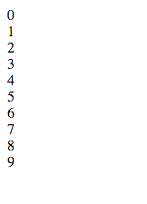
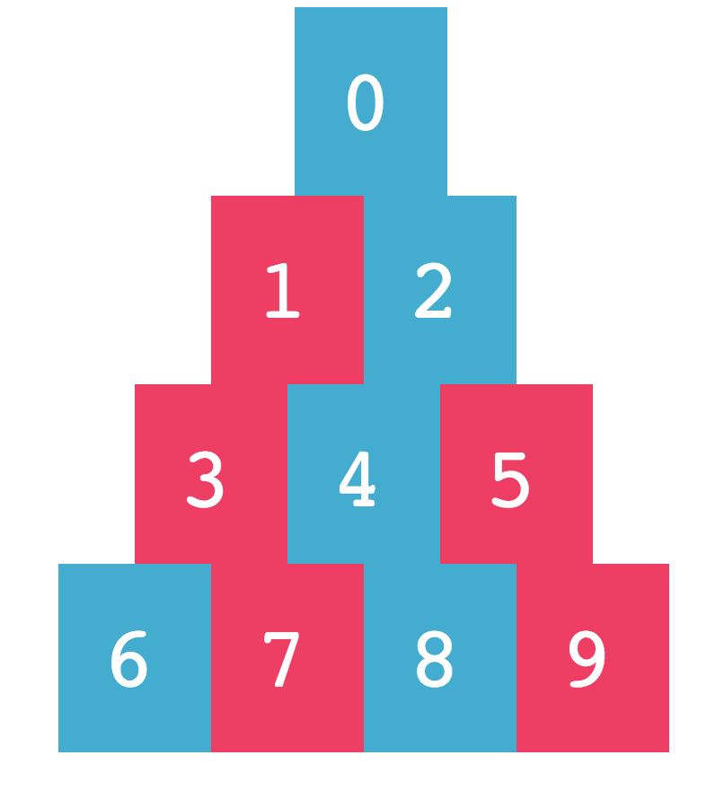

#Fun With Blocks

You have been provided with an HTML file (index.html) and a basic CSS stylesheet (fun-with-blocks.css).  When viewed through a web browser, the page renders as follows:

Without altering the HTML file, provide CSS stylesheets that can render the web page as depicted in each of the exercises below.

## 1. Stack
Create a style sheet that that displays the blocks "stacked" on top of one another.

## 2. In a Row
Create a style sheet that that displays the blocks in a row from left to right.

## 3. Steps
Create a style sheet that that displays the blocks descending in steps.

## 4. Pyramid
Create a style sheet that that displays the blocks as a pyramid. You can alter the HTML file to provide this solution.

